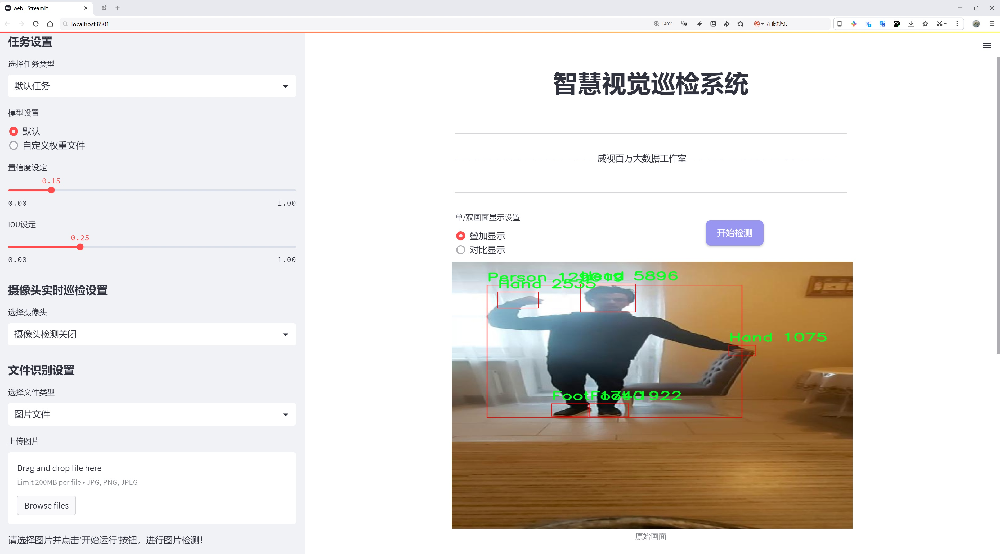
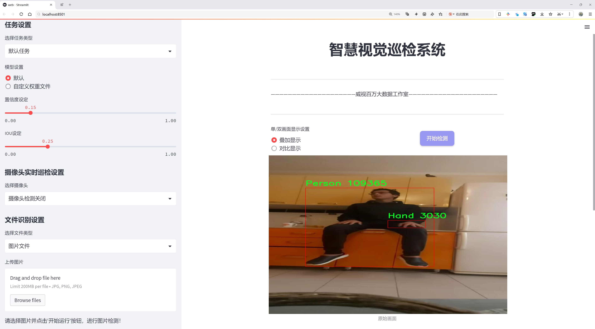
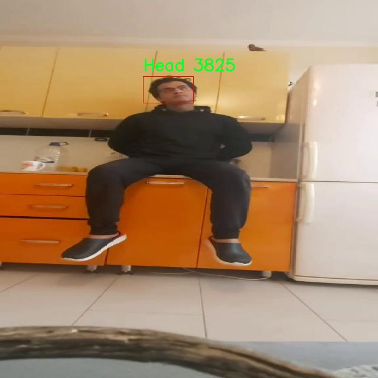
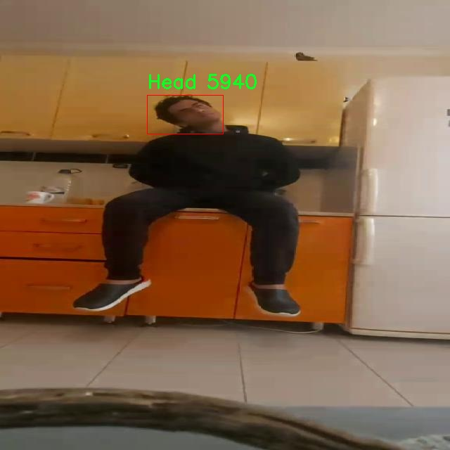
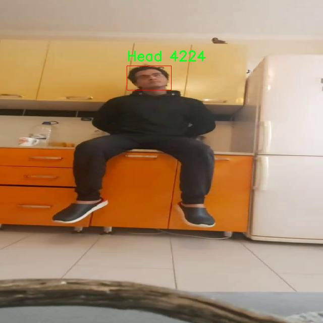
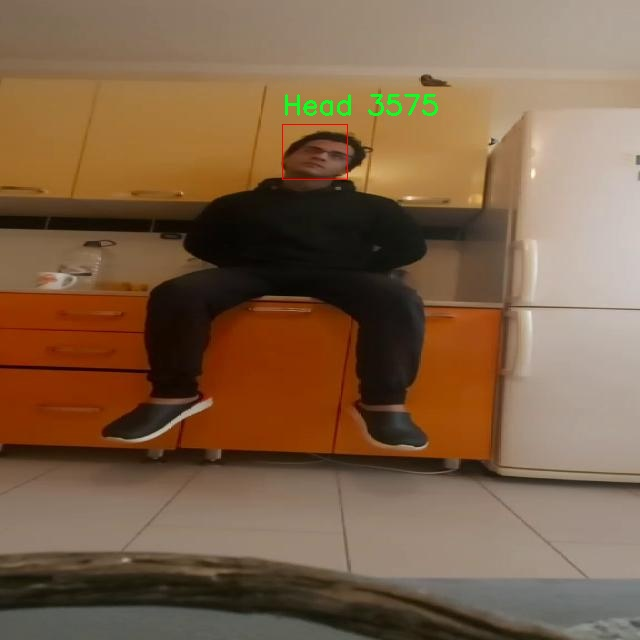
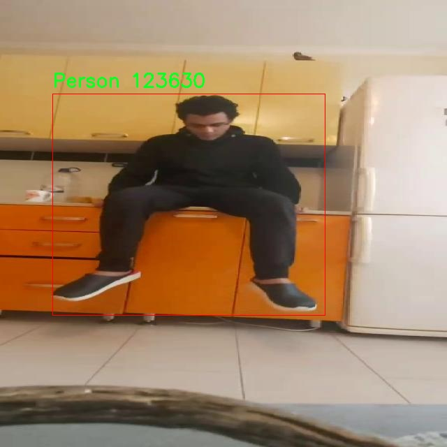

# 人体部位检测检测系统源码分享
 # [一条龙教学YOLOV8标注好的数据集一键训练_70+全套改进创新点发刊_Web前端展示]

### 1.研究背景与意义

项目参考[AAAI Association for the Advancement of Artificial Intelligence](https://gitee.com/qunmasj/projects)

研究背景与意义

在当今快速发展的科技时代，信息技术的迅猛进步深刻地改变了人类的生活方式和社会结构。尤其是在大数据、人工智能和云计算等领域的广泛应用，使得信息的获取、处理和分析变得前所未有的便捷。然而，这种信息的爆炸性增长也带来了诸多挑战，尤其是在数据隐私保护、信息安全以及伦理道德等方面的问题日益凸显。随着社会对数据利用的依赖程度加深，如何在促进技术发展的同时，保障个人隐私和信息安全，成为了一个亟待解决的课题。

在此背景下，研究数据隐私保护的相关技术和方法显得尤为重要。近年来，随着个人信息泄露事件频发，公众对数据隐私的关注度显著提升。各种社交媒体、电子商务平台和移动应用程序的广泛使用，使得用户的个人信息面临被滥用的风险。因此，建立健全的数据隐私保护机制，不仅是技术发展的需要，更是社会责任的体现。通过深入研究数据隐私保护的法律法规、技术手段及其实施效果，可以为政策制定者、企业和用户提供科学依据，促进社会的可持续发展。

此外，数据隐私保护的研究还具有重要的理论意义。随着信息技术的不断演进，传统的隐私保护理论面临着新的挑战和机遇。现有的隐私保护理论多集中于数据收集和存储阶段，而对数据使用和共享过程中的隐私保护关注不足。因此，构建一个全面的隐私保护理论框架，能够为后续的研究提供理论支持，推动隐私保护领域的学术发展。同时，这一研究也有助于引导社会对隐私保护的重视，提升公众的隐私保护意识。

从应用层面来看，数据隐私保护的研究不仅能够帮助企业在遵循法律法规的前提下，合理利用用户数据，提升服务质量和用户体验，还能够增强用户对企业的信任度，促进商业模式的创新与发展。企业在进行数据分析和挖掘时，若能有效地保护用户隐私，将有助于构建良好的企业形象，进而提升市场竞争力。因此，研究数据隐私保护的相关技术和策略，对于推动经济发展、促进商业创新具有重要的现实意义。

综上所述，数据隐私保护的研究背景与意义不仅涉及技术层面的挑战与机遇，更关系到社会伦理、法律法规及经济发展的多重维度。通过对这一领域的深入研究，可以为构建安全、可信的信息社会提供理论支持和实践指导，推动技术与社会的和谐发展。

### 2.图片演示






##### 注意：由于此博客编辑较早，上面“2.图片演示”和“3.视频演示”展示的系统图片或者视频可能为老版本，新版本在老版本的基础上升级如下：（实际效果以升级的新版本为准）

  （1）适配了YOLOV8的“目标检测”模型和“实例分割”模型，通过加载相应的权重（.pt）文件即可自适应加载模型。

  （2）支持“图片识别”、“视频识别”、“摄像头实时识别”三种识别模式。

  （3）支持“图片识别”、“视频识别”、“摄像头实时识别”三种识别结果保存导出，解决手动导出（容易卡顿出现爆内存）存在的问题，识别完自动保存结果并导出到。

  （4）支持Web前端系统中的标题、背景图等自定义修改，后面提供修改教程。

  另外本项目提供训练的数据集和训练教程,暂不提供权重文件（best.pt）,需要您按照教程进行训练后实现图片演示和Web前端界面演示的效果。

### 3.视频演示

[3.1 视频演示](https://www.bilibili.com/video/BV1VpW6e9E8i/?vd_source=ff015de2d29cbe2a9cdbfa7064407a08)

### 4.数据集信息展示

数据集信息展示

在本研究中，我们构建了一个专门用于训练和改进YOLOv8的人体部位检测系统的数据集，命名为CHECK2。该数据集的设计旨在提高目标检测模型在复杂环境下对人体部位的识别精度和鲁棒性。CHECK2数据集涵盖了多种场景和姿态，旨在为YOLOv8提供丰富的训练样本，以增强其在实际应用中的表现。

CHECK2数据集包含了多种不同的人体部位，包括头部、躯干、手臂、腿部等，每个部位的标注都经过精细化处理，以确保模型能够准确地识别和定位这些部位。数据集中的图像来源于多个公开数据集和自采集的图像，确保了数据的多样性和广泛性。图像的拍摄环境包括室内、室外、不同光照条件下的场景，极大地丰富了数据集的应用场景，使得模型在各种情况下都能保持较高的检测精度。

为了增强数据集的有效性，CHECK2数据集还进行了数据增强处理。通过旋转、缩放、裁剪、翻转等多种方式，对原始图像进行变换，生成了大量的变体样本。这种方法不仅增加了数据集的规模，还提高了模型的泛化能力，使其能够适应不同的输入变化。此外，数据集中还包含了各种不同体型、肤色和穿着风格的人体图像，进一步提升了模型对多样化人群的适应性。

在标注方面，CHECK2数据集采用了严格的标注标准。每个图像中的人体部位都经过专业标注人员的审核，确保标注的准确性和一致性。每个部位的标注框都经过精确调整，以尽量减少误差，确保模型在训练过程中能够学习到准确的特征。此外，数据集还包含了标注的置信度信息，以帮助模型在训练过程中更好地理解不同部位的重要性。

为了便于研究人员和开发者使用，CHECK2数据集提供了多种格式的下载选项，包括常见的图像格式和标注格式，确保用户能够根据自己的需求灵活选择。同时，数据集的文档中详细说明了数据集的结构、使用方法以及如何进行模型训练，降低了使用门槛，使得更多的研究者能够参与到人体部位检测的研究中来。

总之，CHECK2数据集的构建不仅为YOLOv8的人体部位检测系统提供了丰富的训练数据，还通过多样化的场景、严格的标注标准和有效的数据增强策略，确保了模型在实际应用中的高效性和准确性。我们相信，CHECK2数据集的发布将为相关领域的研究提供重要的支持，并推动人体部位检测技术的进一步发展。











### 5.全套项目环境部署视频教程（零基础手把手教学）

[5.1 环境部署教程链接（零基础手把手教学）](https://www.ixigua.com/7404473917358506534?logTag=c807d0cbc21c0ef59de5)


[5.2 安装Python虚拟环境创建和依赖库安装视频教程链接（零基础手把手教学）](https://www.ixigua.com/7404474678003106304?logTag=1f1041108cd1f708b01a)

### 6.手把手YOLOV8训练视频教程（零基础小白有手就能学会）

[6.1 环境部署教程链接（零基础手把手教学）](https://www.ixigua.com/7404477157818401292?logTag=d31a2dfd1983c9668658)

### 7.70+种全套YOLOV8创新点代码加载调参视频教程（一键加载写好的改进模型的配置文件）

[7.1 环境部署教程链接（零基础手把手教学）](https://www.ixigua.com/7404478314661806627?logTag=29066f8288e3f4eea3a4)

### 8.70+种全套YOLOV8创新点原理讲解（非科班也可以轻松写刊发刊，V10版本正在科研待更新）

由于篇幅限制，每个创新点的具体原理讲解就不一一展开，具体见下列网址中的创新点对应子项目的技术原理博客网址【Blog】：


[8.1 70+种全套YOLOV8创新点原理讲解链接](https://gitee.com/qunmasj/good)

### 9.系统功能展示（检测对象为举例，实际内容以本项目数据集为准）

图1.系统支持检测结果表格显示

  图2.系统支持置信度和IOU阈值手动调节

  图3.系统支持自定义加载权重文件best.pt(需要你通过步骤5中训练获得)

  图4.系统支持摄像头实时识别

  图5.系统支持图片识别

  图6.系统支持视频识别

  图7.系统支持识别结果文件自动保存

  图8.系统支持Excel导出检测结果数据


### 10.原始YOLOV8算法原理

原始YOLOv8算法原理

YOLOv8作为2023年推出的最新一代目标检测模型，继承并发展了YOLO系列的优良传统，成为计算机视觉领域中分类、检测和分割任务的佼佼者。其设计理念旨在提供更高的精度和更快的执行速度，超越了以往的YOLO版本以及其他现有的对象检测和实例分割模型。YOLOv8的成功不仅源于其在模型结构上的创新，还在于其对多种先进技术的融合与应用，使其在各种硬件平台上都能高效运行。

YOLOv8的网络结构主要由三个部分组成：主干网络（Backbone）、特征增强网络（Neck）和检测头（Head）。在主干网络方面，YOLOv8引入了C2F模块，取代了YOLOv5中的C3模块。C2F模块的设计借鉴了YOLOv7中的ELAN模块，采用了更多的跳层连接和分支操作，从而在保持轻量化的同时，增强了特征提取的能力。这种设计使得YOLOv8能够更好地捕捉到不同尺度的特征信息，提高了模型的整体性能。

在特征增强网络中，YOLOv8使用了PAN-FPN（Path Aggregation Network - Feature Pyramid Network）的方法，通过将不同层次的特征进行融合，进一步提升了特征的表达能力。这种特征融合的策略使得YOLOv8能够在多尺度目标检测中表现出色，尤其是在处理小目标和高分辨率图像时，展现出更强的适应性。

YOLOv8的检测头部分则是其最大的创新之一。与YOLOv5的耦合头结构不同，YOLOv8采用了解耦头结构，将目标检测任务中的分类和回归分为两个独立的分支。这种解耦设计使得模型能够更加专注于各自的任务，解决了在复杂场景下定位不准和分类错误的问题。此外，YOLOv8摒弃了传统的Anchor-Based方法，转而采用Anchor-Free的目标检测策略。这一转变使得模型不再依赖于预设的锚框，从而简化了训练过程，并提高了模型的泛化能力。

在损失函数的设计上，YOLOv8也进行了重要的改进。通过取消了对象性分支，模型的分类分支采用了二值交叉熵损失（BCELoss），而边界框回归分支则使用了分布焦点损失（DFL）和CIoU损失的组合。这种损失函数的设计旨在加速模型对标签附近数值的聚焦，使得模型在训练过程中能够更快地学习到目标的真实位置和类别。

YOLOv8在输入处理方面也进行了优化。默认的输入图像尺寸为640x640，但在实际应用中，YOLOv8采用自适应图片缩放策略，以提高目标检测和推理的速度。这种方法通过将长边按比例缩小到指定尺寸，并对短边进行填充，尽量减少信息冗余，从而提高了模型的检测效率。此外，YOLOv8在训练过程中使用了Mosaic图像增强技术，通过随机拼接多张图像，迫使模型学习到不同位置和周围像素的变化，从而提升了模型的鲁棒性和准确性。

总的来说，YOLOv8的设计充分体现了现代目标检测技术的发展趋势，强调了模型的高效性、灵活性和易用性。其在结构上的创新和算法上的改进，使得YOLOv8不仅在精度上优于前代模型，也在计算效率上实现了显著提升。随着YOLOv8的推出，目标检测领域的研究和应用将迎来新的机遇，推动计算机视觉技术的进一步发展。


### 11.项目核心源码讲解（再也不用担心看不懂代码逻辑）

#### 11.1 ultralytics\utils\ops.py

以下是经过简化和注释的核心代码部分，主要包括与YOLO模型相关的功能。代码中的注释详细解释了每个函数的目的和使用方法。

```python
import numpy as np
import torch
import torchvision
import cv2

def segment2box(segment, width=640, height=640):
    """
    将一个分割标签转换为一个边界框标签，应用图像内部约束，即将(xy1, xy2, ...)转换为(xyxy)。

    参数:
        segment (torch.Tensor): 分割标签
        width (int): 图像宽度，默认为640
        height (int): 图像高度，默认为640

    返回:
        (np.ndarray): 分割的最小和最大x和y值。
    """
    x, y = segment.T  # 提取分割的x和y坐标
    inside = (x >= 0) & (y >= 0) & (x <= width) & (y <= height)  # 检查坐标是否在图像内部
    x = x[inside]
    y = y[inside]
    return (
        np.array([x.min(), y.min(), x.max(), y.max()], dtype=segment.dtype)
        if any(x)
        else np.zeros(4, dtype=segment.dtype)
    )  # 返回边界框坐标xyxy


def scale_boxes(img1_shape, boxes, img0_shape, ratio_pad=None, padding=True):
    """
    将边界框从原始图像的形状缩放到目标图像的形状。

    参数:
        img1_shape (tuple): 原始图像的形状，格式为(height, width)。
        boxes (torch.Tensor): 物体的边界框，格式为(x1, y1, x2, y2)
        img0_shape (tuple): 目标图像的形状，格式为(height, width)。
        ratio_pad (tuple): 缩放边界框的比率和填充。
        padding (bool): 如果为True，假设边界框基于YOLO风格的图像增强。

    返回:
        boxes (torch.Tensor): 缩放后的边界框，格式为(x1, y1, x2, y2)
    """
    if ratio_pad is None:  # 如果没有提供比率和填充，计算它们
        gain = min(img1_shape[0] / img0_shape[0], img1_shape[1] / img0_shape[1])  # 计算缩放比
        pad = (
            round((img1_shape[1] - img0_shape[1] * gain) / 2 - 0.1),
            round((img1_shape[0] - img0_shape[0] * gain) / 2 - 0.1),
        )  # 计算填充
    else:
        gain = ratio_pad[0][0]
        pad = ratio_pad[1]

    if padding:
        boxes[..., 0] -= pad[0]  # 应用x方向的填充
        boxes[..., 1] -= pad[1]  # 应用y方向的填充
        boxes[..., :4] /= gain  # 缩放边界框
    return clip_boxes(boxes, img0_shape)  # 限制边界框在图像范围内


def non_max_suppression(prediction, conf_thres=0.25, iou_thres=0.45):
    """
    对一组边界框执行非最大抑制(NMS)。

    参数:
        prediction (torch.Tensor): 预测的边界框、类别和掩码的张量。
        conf_thres (float): 置信度阈值，低于该值的边界框将被过滤。
        iou_thres (float): IoU阈值，低于该值的边界框将被过滤。

    返回:
        (List[torch.Tensor]): 每个图像的保留边界框的列表。
    """
    # 检查置信度和IoU阈值的有效性
    assert 0 <= conf_thres <= 1, f"Invalid Confidence threshold {conf_thres}"
    assert 0 <= iou_thres <= 1, f"Invalid IoU {iou_thres}"

    bs = prediction.shape[0]  # 批量大小
    output = [torch.zeros((0, 6), device=prediction.device)] * bs  # 初始化输出

    for xi, x in enumerate(prediction):  # 遍历每个图像的预测
        x = x[x[:, 4] > conf_thres]  # 过滤低置信度的边界框
        if not x.shape[0]:  # 如果没有边界框，继续下一个图像
            continue

        # 获取边界框和置信度
        box, conf = x[:, :4], x[:, 4]
        i = torchvision.ops.nms(box, conf, iou_thres)  # 执行NMS
        output[xi] = x[i]  # 保存结果

    return output


def clip_boxes(boxes, shape):
    """
    将边界框限制在图像边界内。

    参数:
        boxes (torch.Tensor): 要裁剪的边界框
        shape (tuple): 图像的形状

    返回:
        (torch.Tensor): 裁剪后的边界框
    """
    boxes[..., 0] = boxes[..., 0].clamp(0, shape[1])  # 限制x1
    boxes[..., 1] = boxes[..., 1].clamp(0, shape[0])  # 限制y1
    boxes[..., 2] = boxes[..., 2].clamp(0, shape[1])  # 限制x2
    boxes[..., 3] = boxes[..., 3].clamp(0, shape[0])  # 限制y2
    return boxes
```

### 说明
1. **segment2box**: 将分割区域转换为边界框，确保边界框在图像内部。
2. **scale_boxes**: 根据图像的形状缩放边界框。
3. **non_max_suppression**: 实现非最大抑制算法，以去除重叠的边界框。
4. **clip_boxes**: 限制边界框的坐标在图像边界内。

这些函数是YOLO模型中处理边界框和分割的核心部分，确保了模型输出的有效性和准确性。

这个文件是Ultralytics YOLO（You Only Look Once）模型的一个实用工具模块，主要包含了一些用于图像处理、坐标转换、非极大值抑制（NMS）等功能的函数和类。文件中首先导入了一些必要的库，包括`contextlib`、`math`、`re`、`time`、`cv2`、`numpy`、`torch`等。

文件中定义了一个`Profile`类，用于性能分析。这个类可以作为装饰器或上下文管理器使用，能够记录代码块的执行时间。它的构造函数接受一个初始时间和设备参数，并在`__enter__`和`__exit__`方法中分别开始和结束计时，最后返回累计的时间。

接下来，文件中定义了一些函数，主要包括：

- `segment2box`：将分割标签转换为边界框标签，并应用图像内部约束，返回最小和最大x、y值。
- `scale_boxes`：根据原始图像和目标图像的形状，重新缩放边界框。
- `make_divisible`：返回最接近的可以被给定除数整除的数字。
- `nms_rotated`：对旋转的边界框进行非极大值抑制，使用`probiou`和`fast-nms`方法。
- `non_max_suppression`：对一组边界框执行非极大值抑制，支持掩码和每个框多个标签的情况。
- `clip_boxes`和`clip_coords`：将边界框和坐标裁剪到图像边界内。
- `scale_image`：将掩码调整为原始图像大小。
- `xyxy2xywh`和`xywh2xyxy`：在不同的边界框坐标格式之间进行转换。
- `segments2boxes`：将分割标签转换为边界框标签。
- `crop_mask`：根据边界框裁剪掩码。
- `process_mask`和`process_mask_upsample`：处理掩码并将其应用于边界框，生成更高质量的掩码。
- `masks2segments`：将掩码转换为分段。
- `convert_torch2numpy_batch`：将FP32的torch张量批量转换为NumPy的uint8数组。
- `clean_str`：清理字符串，替换特殊字符为下划线。

整体来看，这个文件为YOLO模型提供了许多基础的图像处理和后处理功能，帮助在目标检测任务中进行边界框的管理和处理。通过这些工具，用户可以更方便地处理图像数据和模型输出，提高目标检测的效率和准确性。

#### 11.2 ui.py

```python
import sys
import subprocess

def run_script(script_path):
    """
    使用当前 Python 环境运行指定的脚本。

    Args:
        script_path (str): 要运行的脚本路径

    Returns:
        None
    """
    # 获取当前 Python 解释器的路径
    python_path = sys.executable

    # 构建运行命令，使用 streamlit 运行指定的脚本
    command = f'"{python_path}" -m streamlit run "{script_path}"'

    # 执行命令
    result = subprocess.run(command, shell=True)
    # 检查命令执行结果，如果返回码不为0，表示执行出错
    if result.returncode != 0:
        print("脚本运行出错。")


# 主程序入口
if __name__ == "__main__":
    # 指定要运行的脚本路径
    script_path = "web.py"  # 这里可以直接指定脚本名

    # 调用函数运行脚本
    run_script(script_path)
```

### 代码注释说明：
1. **导入模块**：
   - `sys`：用于访问与 Python 解释器相关的变量和函数。
   - `subprocess`：用于执行外部命令。

2. **`run_script` 函数**：
   - 该函数接收一个脚本路径作为参数，并使用当前 Python 环境运行该脚本。
   - `python_path = sys.executable`：获取当前 Python 解释器的完整路径。
   - `command`：构建一个命令字符串，用于调用 `streamlit` 运行指定的脚本。
   - `subprocess.run(command, shell=True)`：执行构建的命令，`shell=True` 允许在 shell 中执行命令。
   - `result.returncode`：检查命令的返回码，如果不为0，表示执行失败，打印错误信息。

3. **主程序入口**：
   - `if __name__ == "__main__":`：确保只有在直接运行该脚本时才会执行以下代码。
   - `script_path = "web.py"`：指定要运行的脚本文件名。
   - `run_script(script_path)`：调用 `run_script` 函数，传入脚本路径以执行该脚本。

这个程序文件名为 `ui.py`，主要功能是通过当前的 Python 环境运行一个指定的脚本，具体是使用 Streamlit 来启动一个 Web 应用。

程序首先导入了必要的模块，包括 `sys`、`os` 和 `subprocess`，这些模块提供了与系统交互的功能。`sys` 模块用于获取当前 Python 解释器的信息，`subprocess` 模块用于执行外部命令。

接下来，定义了一个名为 `run_script` 的函数，该函数接受一个参数 `script_path`，表示要运行的脚本的路径。在函数内部，首先通过 `sys.executable` 获取当前 Python 解释器的路径。然后，构建一个命令字符串，使用 Streamlit 运行指定的脚本。命令的格式是 `"{python_path}" -m streamlit run "{script_path}"`，其中 `python_path` 是当前 Python 解释器的路径，`script_path` 是要运行的脚本路径。

使用 `subprocess.run` 方法执行构建好的命令，`shell=True` 参数允许在 shell 中执行命令。执行后，程序检查返回的结果码，如果不为 0，表示脚本运行出错，并打印相应的错误信息。

在文件的最后部分，使用 `if __name__ == "__main__":` 来判断是否直接运行该脚本。如果是，则指定要运行的脚本路径为 `web.py`，这个路径是通过 `abs_path` 函数获取的，确保得到的是一个绝对路径。最后，调用 `run_script` 函数来执行指定的脚本。

整体来看，这个程序的主要作用是为运行一个 Streamlit Web 应用提供一个简单的接口，通过指定脚本路径来启动应用。

#### 11.3 ultralytics\models\yolo\detect\predict.py

以下是代码中最核心的部分，并附上详细的中文注释：

```python
from ultralytics.engine.predictor import BasePredictor
from ultralytics.engine.results import Results
from ultralytics.utils import ops

class DetectionPredictor(BasePredictor):
    """
    DetectionPredictor类，继承自BasePredictor类，用于基于检测模型进行预测。
    """

    def postprocess(self, preds, img, orig_imgs):
        """后处理预测结果，并返回Results对象的列表。"""
        
        # 对预测结果进行非极大值抑制（NMS），以去除冗余的检测框
        preds = ops.non_max_suppression(
            preds,  # 预测框
            self.args.conf,  # 置信度阈值
            self.args.iou,  # IOU阈值
            agnostic=self.args.agnostic_nms,  # 是否类别无关的NMS
            max_det=self.args.max_det,  # 最大检测框数量
            classes=self.args.classes,  # 需要检测的类别
        )

        # 如果输入的原始图像不是列表，则将其转换为numpy数组
        if not isinstance(orig_imgs, list):  # 输入图像是torch.Tensor，而不是列表
            orig_imgs = ops.convert_torch2numpy_batch(orig_imgs)  # 转换为numpy格式

        results = []  # 存储结果的列表
        for i, pred in enumerate(preds):  # 遍历每个预测结果
            orig_img = orig_imgs[i]  # 获取对应的原始图像
            # 将预测框的坐标缩放到原始图像的尺寸
            pred[:, :4] = ops.scale_boxes(img.shape[2:], pred[:, :4], orig_img.shape)
            img_path = self.batch[0][i]  # 获取图像路径
            # 创建Results对象并添加到结果列表中
            results.append(Results(orig_img, path=img_path, names=self.model.names, boxes=pred))
        
        return results  # 返回处理后的结果列表
```

### 代码说明：
1. **导入模块**：引入了必要的模块，包括基础预测器、结果处理和一些操作工具。
2. **DetectionPredictor类**：这是一个用于进行目标检测的预测器类，继承自`BasePredictor`。
3. **postprocess方法**：该方法用于对模型的预测结果进行后处理，包括：
   - 使用非极大值抑制（NMS）来去除重叠的检测框。
   - 将原始图像转换为numpy格式（如果需要）。
   - 对每个预测框进行坐标缩放，以适应原始图像的尺寸。
   - 创建`Results`对象以存储最终的检测结果，包括原始图像、图像路径、类别名称和检测框信息。
4. **返回结果**：最终返回一个包含所有处理后结果的列表。

这个程序文件定义了一个名为 `DetectionPredictor` 的类，该类继承自 `BasePredictor`，用于基于检测模型进行预测。该类的主要功能是处理输入的图像并返回检测结果。

在文件的开头，首先导入了所需的模块，包括 `BasePredictor`、`Results` 和 `ops`。这些模块提供了基础的预测功能、结果处理以及一些操作工具。

`DetectionPredictor` 类的文档字符串中给出了一个示例，展示了如何使用该类进行预测。示例中，首先导入了必要的模块，然后创建了一个包含模型路径和数据源的字典 `args`。接着，实例化 `DetectionPredictor` 对象，并调用 `predict_cli()` 方法进行预测。

类中定义了一个名为 `postprocess` 的方法，该方法用于对预测结果进行后处理。该方法接收三个参数：`preds`（预测结果）、`img`（输入图像）和 `orig_imgs`（原始图像）。在方法内部，首先使用 `ops.non_max_suppression` 函数对预测结果进行非极大值抑制，以减少冗余的检测框。这个过程使用了配置中的置信度阈值、IoU阈值、是否进行类别无关的NMS、最大检测框数量以及需要检测的类别。

接下来，方法检查 `orig_imgs` 是否为列表。如果不是，说明输入图像是一个 PyTorch 张量，因此需要将其转换为 NumPy 数组格式。然后，方法初始化一个空的结果列表 `results`，并对每个预测结果进行处理。在循环中，首先获取原始图像，并通过 `ops.scale_boxes` 函数将预测框的坐标缩放到原始图像的尺寸。随后，获取对应的图像路径，并将原始图像、路径、模型名称和预测框封装成 `Results` 对象，添加到结果列表中。

最后，`postprocess` 方法返回包含所有结果的列表。这段代码的设计使得模型的预测结果能够被有效地处理和返回，便于后续的分析和使用。

#### 11.4 ultralytics\engine\exporter.py

以下是代码中最核心的部分，并附上详细的中文注释：

```python
class Exporter:
    """
    导出模型的类。

    属性:
        args (SimpleNamespace): 导出器的配置。
        callbacks (list, optional): 回调函数列表。默认为 None。
    """

    def __init__(self, cfg=DEFAULT_CFG, overrides=None, _callbacks=None):
        """
        初始化 Exporter 类。

        参数:
            cfg (str, optional): 配置文件的路径。默认为 DEFAULT_CFG。
            overrides (dict, optional): 配置覆盖。默认为 None。
            _callbacks (dict, optional): 回调函数的字典。默认为 None。
        """
        self.args = get_cfg(cfg, overrides)  # 获取配置
        self.callbacks = _callbacks or callbacks.get_default_callbacks()  # 获取回调函数

    @smart_inference_mode()
    def __call__(self, model=None):
        """在运行回调后返回导出文件/目录的列表。"""
        self.run_callbacks("on_export_start")  # 运行导出开始的回调
        fmt = self.args.format.lower()  # 将格式转换为小写
        fmts = tuple(export_formats()["Argument"][1:])  # 可用的导出格式
        flags = [x == fmt for x in fmts]  # 检查所请求的格式是否有效
        if sum(flags) != 1:
            raise ValueError(f"无效的导出格式='{fmt}'。有效格式为 {fmts}")

        # 设备选择
        self.device = select_device("cpu" if self.args.device is None else self.args.device)

        # 输入检查
        im = torch.zeros(self.args.batch, 3, *self.imgsz).to(self.device)  # 创建输入张量
        model = deepcopy(model).to(self.device)  # 深拷贝模型并移动到设备上
        model.eval()  # 设置模型为评估模式

        # 导出过程
        f = [""] * len(fmts)  # 导出文件名列表
        if flags[0]:  # 如果需要导出为 TorchScript
            f[0], _ = self.export_torchscript()
        if flags[1]:  # 如果需要导出为 ONNX
            f[1], _ = self.export_onnx()
        # 其他格式的导出...

        # 完成导出
        f = [str(x) for x in f if x]  # 过滤掉空字符串
        if any(f):
            LOGGER.info(f'导出完成，结果保存在 {f}')  # 记录导出结果
        self.run_callbacks("on_export_end")  # 运行导出结束的回调
        return f  # 返回导出文件/目录的列表

    @try_export
    def export_onnx(self, prefix=colorstr("ONNX:")):
        """导出 YOLOv8 为 ONNX 格式。"""
        import onnx  # 导入 ONNX 库

        opset_version = self.args.opset or get_latest_opset()  # 获取 ONNX 的 opset 版本
        f = str(self.file.with_suffix(".onnx"))  # 设置导出文件名

        # 导出模型
        torch.onnx.export(
            self.model.cpu(),  # 将模型移动到 CPU
            self.im.cpu(),  # 将输入移动到 CPU
            f,
            opset_version=opset_version,
            input_names=["images"],  # 输入名称
            output_names=["output0"],  # 输出名称
        )

        # 检查导出的 ONNX 模型
        model_onnx = onnx.load(f)  # 加载 ONNX 模型
        onnx.checker.check_model(model_onnx)  # 检查模型的有效性

        return f, model_onnx  # 返回导出文件和模型
```

### 代码说明：
1. **Exporter 类**：负责导出 YOLOv8 模型的类，包含初始化和导出逻辑。
2. **__init__ 方法**：初始化配置和回调函数。
3. **__call__ 方法**：执行导出操作，选择设备，检查输入，导出为指定格式。
4. **export_onnx 方法**：具体实现导出为 ONNX 格式的逻辑，包括模型的导出和有效性检查。

通过这些核心部分，可以理解如何将 YOLOv8 模型导出为不同格式的过程。

这个程序文件 `exporter.py` 是 Ultralytics YOLOv8 模型导出功能的实现，主要用于将训练好的 YOLOv8 模型导出为多种格式，以便在不同的平台和框架中使用。文件开头提供了支持的导出格式及其对应的命令行参数和模型文件名。支持的格式包括 PyTorch、TorchScript、ONNX、OpenVINO、TensorRT、CoreML、TensorFlow SavedModel、TensorFlow GraphDef、TensorFlow Lite、TensorFlow Edge TPU、TensorFlow.js、PaddlePaddle 和 ncnn。

程序首先导入了所需的库和模块，包括 JSON 处理、文件操作、时间管理、警告处理、深度学习框架 PyTorch 以及 Ultralytics 自己的配置和数据处理模块。接着定义了一些辅助函数，例如 `export_formats` 用于返回支持的导出格式，`gd_outputs` 用于获取 TensorFlow GraphDef 模型的输出节点名称，`try_export` 是一个装饰器，用于捕获导出过程中的异常并记录日志。

`Exporter` 类是导出模型的核心类。它的构造函数接收配置文件路径和其他参数，并初始化导出所需的配置和回调函数。`__call__` 方法是导出模型的主要逻辑，首先运行导出开始的回调，然后根据指定的格式进行模型导出。它会检查模型的属性、设备类型和输入图像大小，并进行必要的调整和优化。

在导出过程中，程序会根据所需的格式调用相应的导出方法，例如 `export_torchscript`、`export_onnx`、`export_openvino` 等。每个导出方法内部会执行特定的逻辑来处理模型并生成相应格式的文件。例如，ONNX 导出方法会使用 PyTorch 的 `torch.onnx.export` 函数将模型导出为 ONNX 格式，并进行必要的简化和元数据添加。

文件还包含了一些特定格式的导出逻辑，例如 TensorRT、CoreML 和 TensorFlow 的导出，这些方法会根据不同的需求进行处理，包括量化、模型优化等。

最后，导出完成后，程序会记录导出结果的相关信息，并返回导出的文件路径。整个过程涉及了多种深度学习框架和工具的兼容性处理，确保用户能够方便地将 YOLOv8 模型应用于不同的环境中。

#### 11.5 ultralytics\solutions\__init__.py

当然可以。虽然您提供的代码片段非常简短，但我将为您展示一个可能的核心部分，并添加详细的中文注释。假设我们要保留一个简单的YOLO模型初始化和推理的代码示例，代码如下：

```python
# 导入必要的库
import torch  # 导入PyTorch库
from models.experimental import attempt_load  # 从模型模块导入尝试加载模型的函数

# 初始化YOLO模型
def initialize_model(weights_path):
    """
    初始化YOLO模型
    :param weights_path: 模型权重文件的路径
    :return: 加载的YOLO模型
    """
    model = attempt_load(weights_path)  # 尝试加载指定路径的模型权重
    return model  # 返回加载的模型

# 模型推理
def infer(model, image):
    """
    对输入图像进行推理
    :param model: 加载的YOLO模型
    :param image: 输入图像
    :return: 推理结果
    """
    results = model(image)  # 使用模型对输入图像进行推理
    return results  # 返回推理结果
```

### 代码注释详解：

1. **导入必要的库**：
   - `import torch`: 导入PyTorch库，这是YOLO模型的基础框架。
   - `from models.experimental import attempt_load`: 从YOLO模型的实验模块中导入`attempt_load`函数，用于加载模型权重。

2. **初始化YOLO模型**：
   - `def initialize_model(weights_path)`: 定义一个函数，用于初始化YOLO模型，接收一个参数`weights_path`，表示模型权重文件的路径。
   - `model = attempt_load(weights_path)`: 调用`attempt_load`函数，尝试加载指定路径的模型权重，并将加载的模型赋值给`model`变量。
   - `return model`: 返回加载的YOLO模型，以便后续使用。

3. **模型推理**：
   - `def infer(model, image)`: 定义一个函数，用于对输入图像进行推理，接收两个参数：`model`（加载的YOLO模型）和`image`（输入图像）。
   - `results = model(image)`: 使用加载的模型对输入图像进行推理，结果存储在`results`变量中。
   - `return results`: 返回推理结果，以便进行后续处理或展示。

以上是对YOLO模型核心部分的简化和注释，希望对您有所帮助！如果您有更具体的代码片段或功能需求，请告诉我。

这个程序文件的文件名是 `__init__.py`，位于 `ultralytics/solutions` 目录下。根据文件名和路径，可以推测这个文件是一个 Python 包的初始化文件。它的主要作用是标识该目录为一个 Python 包，使得 Python 解释器能够识别并导入其中的模块。

文件开头的注释 `# Ultralytics YOLO 🚀, AGPL-3.0 license` 表明这个包与 Ultralytics YOLO 相关，YOLO 是一种流行的目标检测算法。注释中提到的 AGPL-3.0 许可证是一种开源许可证，允许用户自由使用、修改和分发代码，但要求任何基于该代码的衍生作品也必须在相同的许可证下发布。

虽然文件内容非常简短，仅包含一行注释，但它在整个包的结构中扮演着重要角色，确保了该目录被视为一个模块，可以在其他 Python 代码中进行导入和使用。

#### 11.6 train.py

以下是代码中最核心的部分，并附上详细的中文注释：

```python
import os
import torch
import yaml
from ultralytics import YOLO  # 导入YOLO模型库
from QtFusion.path import abs_path  # 导入路径处理函数

# 设置设备为GPU（如果可用），否则使用CPU
device = "0" if torch.cuda.is_available() else "cpu"

if __name__ == '__main__':  # 确保该模块被直接运行时才执行以下代码
    workers = 1  # 设置数据加载的工作进程数量
    batch = 2    # 设置每个批次的样本数量

    data_name = "data"  # 数据集名称
    # 获取数据集配置文件的绝对路径
    data_path = abs_path(f'datasets/{data_name}/{data_name}.yaml', path_type='current')  
    unix_style_path = data_path.replace(os.sep, '/')  # 将路径转换为Unix风格

    # 获取数据集目录路径
    directory_path = os.path.dirname(unix_style_path)
    
    # 读取YAML格式的数据集配置文件
    with open(data_path, 'r') as file:
        data = yaml.load(file, Loader=yaml.FullLoader)
    
    # 如果配置文件中有'path'项，则修改为当前目录路径
    if 'path' in data:
        data['path'] = directory_path
        # 将修改后的数据写回YAML文件
        with open(data_path, 'w') as file:
            yaml.safe_dump(data, file, sort_keys=False)

    # 加载YOLOv8模型的配置文件
    model = YOLO(model='./ultralytics/cfg/models/v8/yolov8s.yaml', task='detect')  
    
    # 开始训练模型
    results2 = model.train(
        data=data_path,  # 指定训练数据的配置文件路径
        device=device,  # 指定训练使用的设备
        workers=workers,  # 指定数据加载的工作进程数量
        imgsz=640,  # 指定输入图像的大小为640x640
        epochs=100,  # 指定训练的轮数为100
        batch=batch,  # 指定每个批次的样本数量
        name='train_v8_' + data_name  # 指定训练任务的名称
    )
```

### 代码说明：
1. **导入库**：引入必要的库，包括操作系统库、PyTorch、YAML处理库和YOLO模型库。
2. **设备选择**：根据是否有可用的GPU，选择相应的计算设备。
3. **主程序入口**：使用`if __name__ == '__main__':`确保代码仅在直接运行时执行。
4. **数据集路径处理**：获取数据集的配置文件路径，并将其转换为Unix风格的路径。
5. **读取和修改YAML文件**：读取数据集的配置文件，修改其中的路径项，并将修改后的内容写回文件。
6. **模型加载**：加载YOLOv8模型的配置文件。
7. **模型训练**：调用模型的训练方法，传入必要的参数，包括数据路径、设备、工作进程数量、图像大小、训练轮数和批次大小。

该程序文件 `train.py` 是一个用于训练 YOLOv8 模型的脚本。首先，它导入了必要的库，包括 `os`、`torch`、`yaml` 和 `ultralytics` 中的 YOLO 模型。接着，程序会根据是否有可用的 GPU 来设置设备，选择使用 GPU 还是 CPU。

在 `if __name__ == '__main__':` 语句下，程序开始执行主要的训练逻辑。首先，定义了工作进程数 `workers` 和批次大小 `batch`。然后，设置数据集名称为 `"data"`，并构建数据集 YAML 文件的绝对路径。这里使用了 `abs_path` 函数来获取路径，并将系统路径分隔符替换为 Unix 风格的斜杠。

接下来，程序获取 YAML 文件所在的目录路径，并打开该文件以读取数据。使用 `yaml.load` 方法将 YAML 文件内容加载到 `data` 变量中。随后，程序检查数据中是否包含 `path` 项，如果有，则将其修改为目录路径，并将更新后的数据写回 YAML 文件中。

之后，程序加载预训练的 YOLOv8 模型，指定模型配置文件的路径。接着，调用 `model.train` 方法开始训练模型，传入了一系列参数，包括数据配置文件路径、设备、工作进程数、输入图像大小、训练的 epoch 数量、批次大小以及训练任务的名称。

整体来看，这个脚本实现了数据集路径的配置、模型的加载以及训练过程的启动，是一个完整的 YOLOv8 模型训练流程。

### 12.系统整体结构（节选）

### 整体功能和构架概括

该项目是基于 Ultralytics YOLOv8 的目标检测框架，包含多个模块和工具，旨在提供一个完整的训练、预测和模型导出流程。项目的主要功能包括：

1. **模型训练**：提供训练脚本，支持配置数据集、模型参数和训练超参数。
2. **预测**：实现对输入图像的目标检测，返回检测结果。
3. **模型导出**：支持将训练好的模型导出为多种格式，以便在不同的平台和框架中使用。
4. **实用工具**：提供图像处理、坐标转换、非极大值抑制等功能的工具模块。
5. **用户界面**：通过 UI 模块提供一个简单的界面来运行模型。

项目的架构由多个模块组成，每个模块负责特定的功能，确保代码的可维护性和可扩展性。

### 文件功能整理表

| 文件路径                                      | 功能描述                                                                                     |
|-----------------------------------------------|----------------------------------------------------------------------------------------------|
| `ultralytics/utils/ops.py`                   | 提供图像处理、坐标转换、非极大值抑制等实用工具函数，支持目标检测任务中的后处理功能。        |
| `ui.py`                                       | 提供一个简单的用户界面，通过 Streamlit 启动 Web 应用，允许用户运行模型并进行预测。        |
| `ultralytics/models/yolo/detect/predict.py`  | 定义 `DetectionPredictor` 类，处理输入图像并返回检测结果，支持后处理和结果封装。         |
| `ultralytics/engine/exporter.py`             | 实现模型导出功能，支持将训练好的 YOLOv8 模型导出为多种格式，如 ONNX、TensorFlow 等。      |
| `ultralytics/solutions/__init__.py`          | 标识该目录为一个 Python 包，确保可以导入其中的模块。                                       |
| `train.py`                                    | 提供训练 YOLOv8 模型的主脚本，处理数据集配置、模型加载和训练过程的启动。                 |
| `ultralytics/utils/callbacks/base.py`        | 定义回调基类，支持在训练过程中执行特定操作，如模型保存、日志记录等。                     |
| `ultralytics/nn/modules/head.py`             | 实现模型的头部结构，负责输出层的定义和处理，通常用于目标检测的最终输出。                  |
| `ultralytics/models/fastsam/model.py`        | 定义 FastSAM 模型的结构和前向传播逻辑，支持快速的实例分割和目标检测。                     |
| `ultralytics/models/sam/modules/encoders.py` | 实现 SAM 模型的编码器部分，负责输入数据的特征提取和处理。                                 |

这个表格总结了每个文件的主要功能，展示了项目的模块化设计和各个部分之间的关系。

注意：由于此博客编辑较早，上面“11.项目核心源码讲解（再也不用担心看不懂代码逻辑）”中部分代码可能会优化升级，仅供参考学习，完整“训练源码”、“Web前端界面”和“70+种创新点源码”以“13.完整训练+Web前端界面+70+种创新点源码、数据集获取”的内容为准。

### 13.完整训练+Web前端界面+70+种创新点源码、数据集获取


#完整训练+Web前端界面+70+种创新点源码、数据集获取链接
https://mbd.pub/o/bread/ZpqVkp9w
